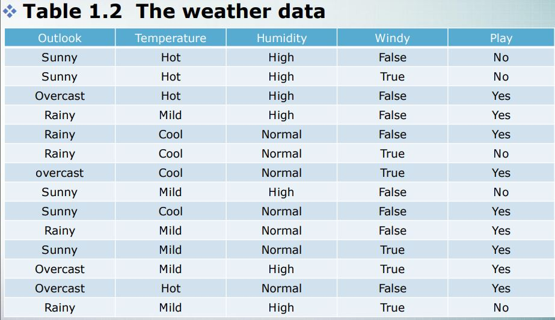
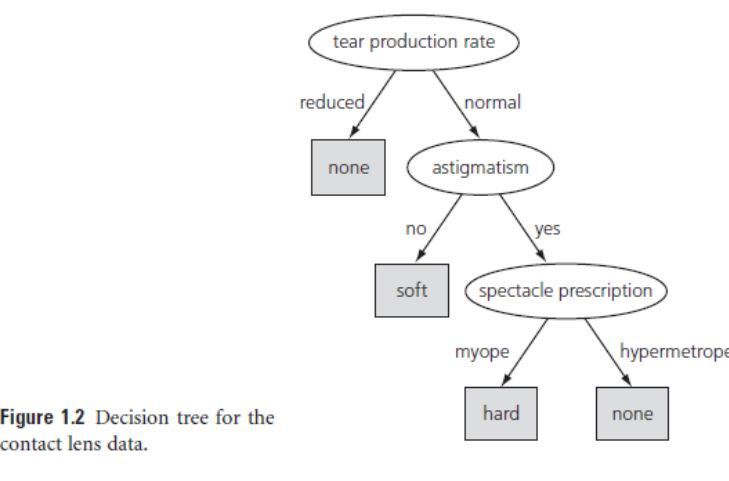

Domain
---

 - Attribute (속성)
 
 - Class <=> Target Concept (우리가 찾아낸 일련의 개념을 통칭)
 
 - Instance (예제)
 
 > Ex> Weather Data 에서는 Play의 유무가 Target Concept가 된다.
 > 자료 
 
  
Classification Rule
---
> 분류규칙

  if then 절에 then 뒤에 class가 작성된것 -> classification rule (분류규칙)
  
Assocation Rule
---
> 연관규칙

 Then 절에 Class의 형식이 나올수도 나오지 않을수도 있다.
 > 모두 class로써 취급하겠다. 
 > 굳이 class와 attribute를 구별하지 않는다. 
 > Attribute들에 대한 상호 연관성을 제시한 것이라고 볼 수 있음
 
 Decision Tree
 ---
 
 Attribute 별로 계층 구조를 이루며
 
 Attribute에 대한 비교에 순서가 정해져있음
 
 
 
 따라서 정보 분류의 능력이 가장 큰 Attribute 가 상위 계층으로 올라가는 형태이다.
 
 Devide & Conquer 의 방식을 띈다.
 
 
